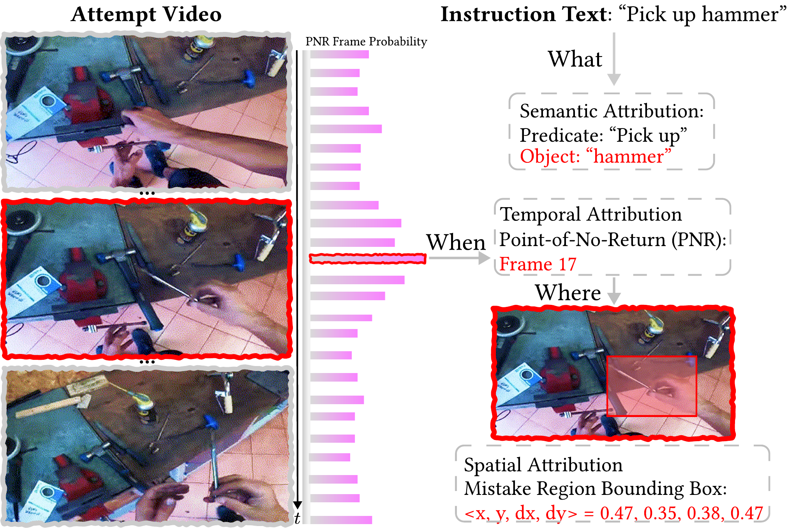

# [CVPR2026] Mistake Attribution: Fine-Grained Mistake Understanding in Egocentric Videos

<div align="center">

[](https://yayuanli.github.io/MATT/)
[](https://arxiv.org/abs/2511.20525)
[](https://huggingface.co/datasets/yayuanli/MATT-Bench)
[](LICENSE)

**[Yayuan Li](https://www.linkedin.com/in/yayuan-li-148659272/)<sup>1</sup> · [Aadit Jain](https://www.linkedin.com/in/jain-aadit/)<sup>1</sup> · [Filippos Bellos](https://www.linkedin.com/in/filippos-bellos-168595156/)<sup>1</sup> · [Jason J. Corso](https://www.linkedin.com/in/jason-corso/)<sup>1,2</sup>**

<sup>1</sup>University of Michigan | <sup>2</sup>Voxel51


</div>

## 📑 0. Open-Source Plan

We plan to release all components of our project according to the following schedule:

- ✅ Paper release
- ✅ Project page setup
- ✅ Ego4D-M & EPIC-KITCHENS-M datasets
- ⬜ MisFormer inference code & model weights
- ⬜ MisFormer training scripts
- ⬜ MisEngine data construction pipeline
- ⬜ Baseline implementations

## 📝 1. Abstract

We introduce **Mistake Attribution (MATT)**, a new task for fine-grained understanding of human mistakes in egocentric videos. Beyond detecting whether a mistake occurs, MATT attributes the mistake to **what** semantic role is violated, **when** the deviation becomes irreversible (the Point-of-No-Return), and **where** it appears in the frame. We contribute **MisEngine**, a scalable data engine that yields Ego4D-M (257K) and EPIC-KITCHENS-M (221K), and **MisFormer**, a unified model that outperforms task-specific SOTA methods across all attribution subtasks.

## 🛠️ 2. Environment Setup

> **Tested Environment**: CUDA 11.7, Ubuntu, Python 3.9

### 2.1. MisFormer (`semantic_attr`)

```bash
# Clone Repository
git clone https://github.com/yayuanli/MATT.git
cd MATT/semantic_attr

# Create Environment (Python 3.9 recommended)
python -m venv venv
source venv/bin/activate
pip install -r requirements.txt
```

The MisFormer visual backbone requires a pre-trained [LaViLa](https://github.com/facebookresearch/LaViLa) checkpoint. Place it at `semantic_attr/model/checkpoint_best.pt` (or pass a custom path via `--LaViLa_ckpt`).

### 2.2. MisEngine (`mis-engine`)

> **Note:** The MisEngine data construction pipeline will be released in a future update. Once available:

```bash
cd MATT/mis-engine
pip install -r requirements.txt
```

`mis-engine` additionally depends on [AllenNLP](https://github.com/allenai/allennlp) (for EgoPER SRL processing). See `mis-engine/requirements.txt` for the full list.

### 2.3. Ego4D

Download instructions coming soon.

**Frame Extraction:** Ego4D videos are distributed as clips (`.mp4`). The dataloader expects pre-extracted frames in the following structure:

```
<frames_dir>/<clip_uid>_frames/00000.png
<frames_dir>/<clip_uid>_frames/00001.png
...
```

Extract frames from each clip using `ffmpeg`:

```bash
ffmpeg -i <clip_uid>.mp4 -vf "scale=640:360" -vsync vfr <clip_uid>_frames/%05d.png
```

> **Note:** Ego4D frame directories can span multiple storage locations. The dataloader accepts up to three root paths via `--root1`, `--root2`, and `--root3` and searches across all of them.

### 2.4. EgoPER

Download instructions coming soon.

**Frame Extraction:** Use the provided script to extract frames at 15 fps from the EgoPER videos:

```bash
cd mis-engine/egoper

python extract_frames.py \
  --input annotation.xlsx \
  --egoper_dir /path/to/EgoPER \
  --output_dir /path/to/EgoPER_frames
```

The resulting frames are stored as `<output_dir>/<video_id>_frames/000001.png` (6-digit zero-padded).

### 2.5. EPIC-Kitchens

Download instructions coming soon.

**Frame Extraction:** EPIC-Kitchens-100 provides official RGB frame download scripts via their [GitHub repository](https://github.com/epic-kitchens/epic-kitchens-download-scripts). The dataloader expects the standard EPIC-Kitchens frame layout:

```
<frames_dir>/<participant_id>/rgb_frames/<video_id>/frame_0000000001.jpg
<frames_dir>/<participant_id>/rgb_frames/<video_id>/frame_0000000002.jpg
...
```

Frame filenames use 10-digit zero-padded numbering (`frame_%010d.jpg`).

### 2.6. HoloAssist

Download the following from the [HoloAssist project page](https://holoassist.github.io/):

| Resource | Link | Size |
|----------|------|------|
| Videos (pitch-shifted) | [video_pitch_shifted.tar](https://hl2data.z5.web.core.windows.net/holoassist-data-release/video_pitch_shifted.tar) | 184.20 GB |
| Labels | [data-annotation-trainval-v1_1.json](https://hl2data.z5.web.core.windows.net/holoassist-data-release/data-annotation-trainval-v1_1.json) | 111 MB |
| Dataset splits | [data-splits-v1_2.zip](https://holoassist.github.io/label_files/data-splits-v1_2.zip) | — |

An [alternative download site](https://www.research-collection.ethz.ch/handle/20.500.11850/683960) is also available.

**Frame Extraction:** First, run `df_fg.py` to generate the annotation spreadsheet (see [Section 5.4](#54-holoassist)), then extract frames at per-video FPS:

```bash
cd mis-engine/holoassist

python extract_frames.py \
  --input df_fg_output.xlsx \
  --video_base_path /path/to/HoloAssist/video_pitch_shifted
```

Frames are written to `<video_dir>/Export_py/video_frames/frame_00001.jpg` (5-digit zero-padded) within each video's directory.

## 🚀 3. Evaluation & Inference

### 3.1. Ego4D, EPIC-Kitchens, HoloAssist

Evaluation is run via `eval_model.py`, which **automatically downloads** the appropriate model checkpoints from Hugging Face (`mistakeattribution/<dataset>`).

```bash
cd semantic_attr
export PYTHONPATH=$(pwd):$PYTHONPATH

python eval_model.py \
  --dataset <dataset_name> \
  --root1 /path/to/frames \
  --test_dataset_path /path/to/test.xlsx \
  --clip_length <num_frames>
```

**Arguments:**

| Argument | Description | Required |
|----------|-------------|----------|
| `--dataset` | Dataset name: `ego4d`, `epic-kitchens`, or `holoassist` | Yes |
| `--root1` | Path to extracted frames directory | Yes |
| `--root2`, `--root3` | Additional frame directories (Ego4D only, when frames span multiple drives) | No |
| `--test_dataset_path` | Path to the test/evaluation `.xlsx` file | Yes |
| `--checkpoint_type` | Which checkpoint to evaluate: `verb`, `arg`, `video`, or `all` (default: `all`) | No |
| `--LaViLa_ckpt` | Path to LaViLa checkpoint (default: `./model/checkpoint_best.pt`) | No |
| `--clip_length` | Frames sampled per clip — use **30** for Ego4D / EPIC-Kitchens, **8** for HoloAssist | No |
| `--batch_size` | Inference batch size (default: 32) | No |
| `--num_workers` | DataLoader workers (default: 12) | No |

Results (per-checkpoint accuracy, precision, recall, F1, and balanced accuracy) are written to `results/<dataset>/`.

### 3.2. EgoPER

EgoPER evaluation will be released in a future update.

## 📊 4. Model Training

Training uses Distributed Data Parallel (DDP) and requires **at least 2 GPUs**. Experiment logging is handled by [Weights & Biases](https://wandb.ai/).

### 4.1. Weights & Biases Setup

```bash
pip install wandb   # included in requirements.txt
wandb login         # paste your API key when prompted
```

### 4.2. Running Training

```bash
cd semantic_attr
export PYTHONPATH=$(pwd):$PYTHONPATH
export MASTER_ADDR="127.0.0.1"
export MASTER_PORT=12355

CUDA_VISIBLE_DEVICES=0,1,2,3 python training_ddp.py \
  --dataset <dataset_name> \
  --root1 /path/to/frames \
  --train_dataset_path /path/to/train.xlsx \
  --valid_dataset_path /path/to/valid.xlsx \
  --output_dir /path/to/checkpoints \
  --recording_epochs /path/to/log.txt \
  --pretrained_ckpt None \
  --wandb_project <project_name>
```

**Arguments:**

| Argument | Description | Default |
|----------|-------------|---------|
| `--dataset` | Dataset name: `ego4d`, `egoper`, `epic-kitchens`, or `holoassist` | *(required)* |
| `--root1` | Path to extracted frames | *(required)* |
| `--root2`, `--root3` | Additional frame directories (Ego4D only) | `""` |
| `--category` | EgoPER food category: `coffee`, `oatmeal`, `pinwheels`, `quesadilla`, `tea`, or `all` | `""` |
| `--train_dataset_path` | Path to training `.xlsx`. For EgoPER: the parent directory containing per-category splits | *(required)* |
| `--train_filename` | Training filename within each EgoPER category folder | `alt_augment_training.xlsx` |
| `--valid_dataset_path` | Path to validation `.xlsx`. For EgoPER: same parent directory as above | *(required)* |
| `--test_dataset_path` | Path to test `.xlsx`, or `None` to skip test evaluation | `None` |
| `--output_dir` | Directory where best checkpoints (`verb_model.pth`, `arg_model.pth`, `video_model.pth`) are saved | *(required)* |
| `--recording_epochs` | Text file path for per-epoch validation metrics. For EgoPER: a directory (each category gets its own `.txt`) | *(required)* |
| `--pretrained_ckpt` | Path to a `.pth` checkpoint to resume from, or `None` to train from scratch (LaViLa init only) | *(required)* |
| `--LaViLa_ckpt` | Path to LaViLa backbone checkpoint | `./model/checkpoint_best.pt` |
| `--clip_length` | Frames sampled per clip — use **30** for Ego4D / EPIC-Kitchens / EgoPER, **8** for HoloAssist | 30 |
| `--global_batch_size` | Total batch size across all GPUs | 64 |
| `--epochs` | Number of training epochs | 20 |
| `--start_epoch` | Epoch to resume from | 0 |
| `--learning_rate` | Optimizer learning rate | 0.0001 |
| `--num_workers` | DataLoader workers per GPU | 12 |
| `--wandb_project` | Weights & Biases project name | *(required)* |

> **Note:** Set `CUDA_VISIBLE_DEVICES` to select which GPUs to use. The script automatically determines `world_size` from the number of visible devices.

## 🔧 5. MisEngine Data Construction Pipeline

MisEngine constructs the Ego4D-M and EPIC-KITCHENS-M datasets by programmatically generating semantic-role misalignment samples from existing egocentric video annotations. Each pipeline produces augmented `.xlsx` splits ready for MisFormer training.

All augmentation scripts produce samples with four label classes:

| Label | Meaning |
|-------|---------|
| 0 | Aligned (no misalignment) |
| 1 | Verb misaligned |
| 2 | Argument misaligned |
| 3 | Both verb and argument misaligned |

### 5.1. Ego4D

The Ego4D pipeline maps narration-level annotations to clip-level frame coordinates and then generates misalignment samples.

> **Note on ambiguous samples:** The source annotations may contain segments where the same `(video_uid, start_frame, end_frame)` tuple maps to multiple distinct verb or argument labels. These ambiguous segments have been **pre-filtered** from the provided annotation files. If starting from a raw parquet export, uncomment the filtering block in `clips.py`.

**Step 1 — Map to clip coordinates:**

```bash
cd mis-engine/ego4d

python clips.py \
  --metadata /path/to/ego4d.json \
  --input parquet.xlsx \
  --output clips.xlsx
```

Reads the Ego4D metadata JSON and the cleaned parquet export. Outputs `clips.xlsx` with clip UIDs and clip-local frame ranges (`clip1_uid`, `clip1_start_frame`, `clip1_end_frame`, and `clip2_*` fields for segments that span two clips).

**Step 2 — Generate misalignment samples:**

```bash
python augment.py \
  --input clips.xlsx \
  --clips_dir /path/to/ego4d/clips \
  --output all_clips_samples.xlsx
```

Filters for clips that exist on disk, groups samples by `(V, ARG1)`, and creates balanced misalignment samples. Outputs `all_clips_samples.xlsx`.

**Step 3 — Create train/valid/test splits:**

```bash
python create_splits.py \
  --input all_clips_samples.xlsx \
  --output_dir /path/to/output \
  --seed 42
```

Randomly shuffles and splits into 80/10/10 train/valid/test. Outputs `train.xlsx`, `valid.xlsx`, `test.xlsx`.

### 5.2. EgoPER

The EgoPER pipeline parses recipe annotations, runs Semantic Role Labeling (SRL) to extract verb/argument pairs, and produces per-food-category splits.

**Step 1 — Parse annotations:**

```bash
cd mis-engine/egoper

python annotation.py \
  --json_path /path/to/EgoPER/annotation.json \
  --output annotation.xlsx
```

Converts the raw EgoPER `annotation.json` into a flat spreadsheet with decoded action strings and action types.

**Step 2 — Run SRL and create per-food splits:**

```bash
python construct_sets.py \
  --input annotation.xlsx \
  --egoper_dir /path/to/EgoPER \
  --output_dir /path/to/EgoPER_processing \
  --device cuda:0
```

Runs AllenNLP SRL on action and error-description sentences to extract `V` (verb) and `ARG1` (argument) roles, computes misalignment labels by comparing action vs. error roles, and writes per-food-category split files (`training.xlsx`, `validation.xlsx`, `test.xlsx`) to `<output_dir>/<food>/`.

**Step 3 — Build augmented training set:**

```bash
python augment.py \
  --input_dir /path/to/EgoPER_processing \
  --output all/train.xlsx
```

Concatenates all five food categories' training splits, generates balanced misalignment samples from normal-action rows, and outputs the combined training file.

**Step 4 — Concatenate validation and test sets:**

```bash
python concatenate.py \
  --input_dir /path/to/EgoPER_processing \
  --output_dir all
```

Combines per-food validation and test splits into `all/validation.xlsx` and `all/test.xlsx`.

**Step 5 — Extract frames:**

```bash
python extract_frames.py \
  --input annotation.xlsx \
  --egoper_dir /path/to/EgoPER \
  --output_dir /path/to/EgoPER_frames
```

Extracts frames at 15 fps from each video referenced in the annotations using `ffmpeg`. See [Section 2.4](#24-egoper).

### 5.3. EPIC-Kitchens

EPIC-Kitchens uses a single augmentation script that reads directly from the [official EPIC-Kitchens-100 annotations](https://github.com/epic-kitchens/epic-kitchens-100-annotations).

```bash
cd mis-engine/epickitchens

python augment.py \
  --split train \
  --annotations_dir /path/to/epic-kitchens-100-annotations \
  --output train.xlsx
```

Reads `EPIC_100_{split}.csv`, renames columns to match the MisFormer schema (`verb` → `V`, `noun` → `ARG1`, `stop_frame` → `end_frame`), groups by `(V, ARG1)`, and generates balanced misalignment samples. Repeat for `validation` and `test` splits.

### 5.4. HoloAssist

The HoloAssist pipeline extracts fine-grained action annotations from the official JSON, splits by video ID, and generates misalignment samples.

> **Note on ambiguous samples:** Some annotation segments in HoloAssist have multiple distinct verb or argument labels for the same `(video_id, start_frame, end_frame)` tuple. `df_fg.py` **automatically filters** these ambiguous segments from the output and reports how many were removed.

**Step 1 — Parse fine-grained annotations:**

```bash
cd mis-engine/holoassist

python df_fg.py \
  --json_path /path/to/data-annotation-trainval-v1_1.json \
  --output df_fg_output.xlsx
```

Extracts all "Fine grained action" events from the HoloAssist annotation JSON, computes frame-level boundaries from timestamps and per-video FPS, and filters ambiguous segments. Outputs `df_fg_output.xlsx`.

**Step 2 — Split by video ID:**

```bash
python split.py \
  --input df_fg_output.xlsx \
  --train_ids /path/to/train.txt \
  --val_ids /path/to/val.txt \
  --test_ids /path/to/test.txt \
  --output_dir .
```

Partitions annotations into `train_base.xlsx`, `validation_base.xlsx`, and `test_base.xlsx` using the official video ID lists from the dataset splits download.

**Step 3 — Generate misalignment samples:**

```bash
python augment.py --split train
python augment.py --split validation
python augment.py --split test
```

For each split, reads `{split}_base.xlsx`, groups by `(V, ARG1)`, and generates balanced misalignment samples. Outputs `train.xlsx`, `validation.xlsx`, `test.xlsx`.

**Step 4 — Extract frames:**

```bash
python extract_frames.py \
  --input df_fg_output.xlsx \
  --video_base_path /path/to/HoloAssist/video_pitch_shifted
```

See [Section 2.6](#26-holoassist).

## 📜 Citation

If you find this work useful in your research, please cite:

```bibtex
@inproceedings{li2026mistakeattribution,
  title     = {Mistake Attribution: Fine-Grained Mistake Understanding in Egocentric Videos},
  author    = {Li, Yayuan and Jain, Aadit and Bellos, Filippos and Corso, Jason J.},
  booktitle = {Proceedings of the IEEE/CVF Conference on Computer Vision and Pattern Recognition (CVPR)},
  year      = {2026},
}
```
